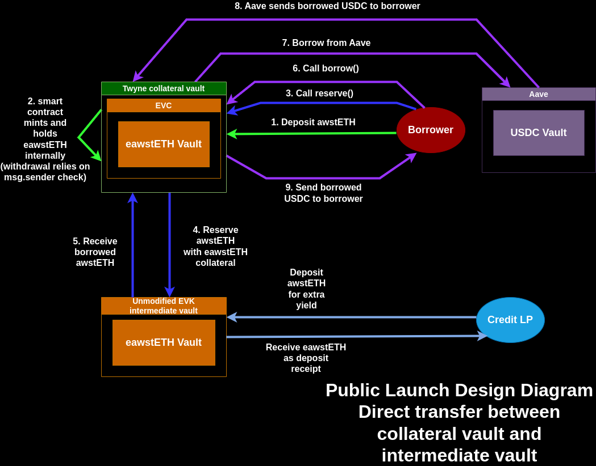
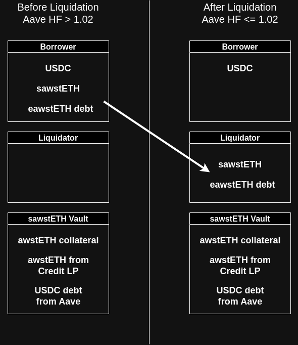

# Twyne Playground

This is an initial attempt of porting over the Euler PoC and transitioning the code into a production-ready direction. The initial effort may be more improvisation to make things work, rather than rigorous planning.

## Architecture

This is the architecture we are aiming for in the POC.



The liquidation process for the initial POC involves the liquidator taking over the borrower's position. This means the protocol does not dictate what the liquidator should do to make the position healthy. The main two options are for the liquidator to make the position more healthy: to repay some of the borrowed Aave assets (by using assets already held or, more commonly, swapping assets to repay the loan) or to deposit more collateral. The first option reduces the borrow position, the other option increases the collateral backing position.



## To run a specific test

If you are setting up your `.env` for the first time: `cp .env.example .env`

```sh
FOUNDRY_PROFILE=mainnet forge test --match-test "test_e_second_creditDeposit" -vv
```

## To run all tests

```sh
FOUNDRY_PROFILE=base forge test --match-contract "EulerTestEdgeCases|EulerLiquidationTest" -vv
```

Note: using llama RPCs like https://eth.llamarpc.com can result in errors due to rate limiting. [Blutgang](https://github.com/rainshowerLabs/blutgang) is recommended to avoid this.

## To check test coverage

If you are setting up your `.env` for the first time: `cp .env.example .env`

```sh
FOUNDRY_PROFILE=base forge coverage --match-contract "EulerTestEdgeCases|EulerLiquidationTest" --no-match-coverage "test|EVault|GenericFactory|ProtocolConfig|SequenceRegistry|Synths|script"
```

And if you want a lcov file to use with a VSCode extension such as [Coverage Gutters](https://marketplace.visualstudio.com/items?itemName=ryanluker.vscode-coverage-gutters), add the `--report lcov` argument to the above.

### Gas snapshot

To save a gas-snapshot of tests:

```sh
FOUNDRY_PROFILE=base forge snapshot --match-path "test/twyne/*"
```

To compare the gas consumption with the saved gas-snapshot:

```sh
FOUNDRY_PROFILE=base forge snapshot --match-path "test/twyne/*" --diff
```

To view the gas consumption of contract functions:

```sh
FOUNDRY_PROFILE=base forge test --match-path "test/twyne/EulerTestNormalActions.t.sol" --gas-report
```

## Euler vs. Twyne code diff

Only the `src/twyne` and `src/TwyneFactory` directories hold unique code from Twyne that is not from Euler Finance's EVK or EVC. You can clone Euler's EVK repo and then confirm the diff with this command:

`diff -r twyne-contracts/src euler-vault-kit/src`

The EVK tests have also been copied over:

`diff -r twyne-contracts/test euler-vault-kit/test`

The solidity lines of code (sloc) can be checked with:

`cloc src/twyne src/TwyneFactory`

## Deployment to Base mainnet

Note: If you will reuse an existing EVK deployment instead of spending gas on a fresh EVK deployment, keep in mind that a new GenericFactory should be deployed (and address updated in the Base deployment script) if you do NOT want the old intermediate vaults showing up on the frontend.

1. Clone evk-periphery and checkout the `deployment-scripts` branch. Run `forge install`. You need to have the [euler-interfaces](https://github.com/euler-xyz/euler-interfaces) repository cloned to the same parent directory where evk-periphery is located. Edit the script at scripts/50_CoreAndPeriphery.s.sol to remove logic related to "Deploying EUL" and "Deploying rEUL" because these are not needed. You should make sure to delete the euler-interfaces/address/8453 directory (or whichever chain you are deploying to) and evk-periphery/script/deployments/* directories.
2. Set .env to specify the values `DEPLOYMENT_RPC_URL` and `DEPLOYER_KEY`, then run Euler's deploy script with `FORCE_MULTISIG_ADDRESSES=true ./script/interactiveDeployment.sh` and choose option 50. Choose "No" for the OFT Adapter question and enter the deployer address for any address prompts and press enter to use the default value for Uniswap and other prompts.
3. Copy the output files with deployed addresses at evk-periphery/script/deployments/onchain/8453/output to the tech-notes/ repo in a new directory for this specific deployment to store the addresses in a shared place.
4. Now back in the playground repo, make sure the .env file has the production private keys with gas to deploy to Base. Also edit script/TwyneDeployEulerIntegration.s.sol so `productionSetup()` contains the addresses of the contracts just deployed by the EVK deploy script. Finally, edit script/TwyneDeployEulerIntegration.s.sol to comment out everything in `run()` except `productionSetup()` and `twyneStuff()`.
5. Run the Twyne deploy script:
`forge script script/TwyneDeployEulerIntegration.s.sol:TwyneDeployEulerIntegration --rpc-url https://gateway.tenderly.co/public/base --broadcast -vv`

## Automatic setup

To install dependencies and run the tests, run `forge build` and the dependencies will automatically get installed.
